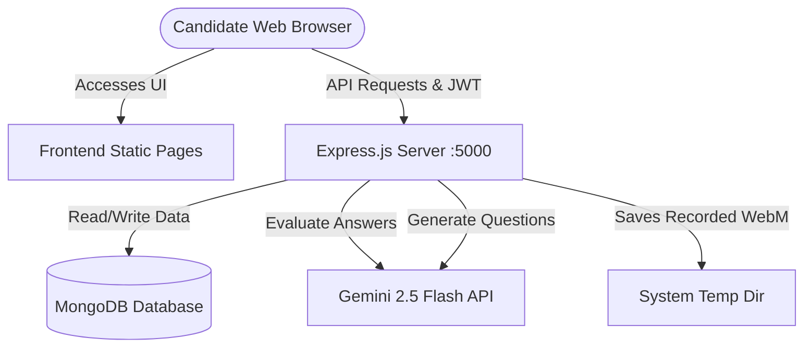

# 🚀 Remote Interview Practice Portal

### *Practice Smart. Perform Better.*
An interactive web platform designed to prepare candidates for remote job interviews. Combining text-based practice sessions, camera-assisted video mock interviews, self-confidence tracking, interactive performance dashboards, and automated AI evaluation.

### 🌐 Live Demo
Access the live deployed platform: **[https://remote-interview-practice-portal.vercel.app/](https://remote-interview-practice-portal.vercel.app/)**

---

## 📌 Architectural Overview



---

## 🎯 Key Features

*   **📝 Text Practice Mode**: Attempt domain-specific questions across different difficulty levels (Easy, Medium, Hard). Includes automated AI feedback and grading.
*   **🔓 Progression System**: Levels unlock dynamically. To unlock Level 2 (Medium), you must complete 5 Easy questions with a score of $\ge 60\%$ on each. To unlock Level 3 (Hard), you must complete 3 Medium questions with a score of $\ge 50\%$ on each.
*   **🎥 Camera-Assisted Mock Interviews**: Simulate real interview rounds. The system performs blocking camera and microphone health checks before launching.
*   **📹 Single-Button Response Recording**: Start recording, record your response, select your confidence rating, and click "Next Question" or "Submit Session". The video is uploaded in the background.
*   **📊 Performance Dashboard**:
    *   **KPI Overview**: Visual badges tracking practice sessions, average practice score, mock interviews attempted, and videos recorded.
    *   **Interactive Performance Graphs**: Track practice scores and mock interview confidence trends side-by-side on a 30-day timeline chart.
    *   **Improvement Suggestions**: Live recommendations compiled from your latest mock interview session's focus areas and feedback.
    *   **Multi-Video Recordings Library**: Play back your individual recorded question responses from the mock history.
*   **👤 Candidate Profile**: Configure LinkedIn/LeetCode URLs and manage interview plans.

---

## 🛠️ Technology Stack

| Component | Technology | Description |
| :--- | :--- | :--- |
| **Frontend** | HTML5, Vanilla CSS3, Javascript (ES6+) | Clean, premium UI with zero heavy framework dependencies. |
| **Backend** | Node.js, Express.js | Robust REST API endpoints. |
| **Database** | MongoDB, Mongoose | Schema-based document modelling. |
| **Integrations** | Gemini 2.5 Flash API | Powers the automated grading and recommendations. |
| **Mail** | Nodemailer | Handles user OTP validations and registration emails. |

---

## 📁 Project Directory Structure

```
Remote_Interview-_Practice_Portal/
├── backend/
│   ├── config/             # DB connections
│   ├── middleware/         # JWT Auth guards
│   ├── models/             # Mongoose Schemas (User, Practice, Mock, Category, etc.)
│   ├── routes/             # REST controllers (auth, dashboard, mock, practice)
│   ├── utils/              # Gemini integration & Mail helper scripts
│   ├── package.json        # Dependencies & start scripts
│   └── server.js           # Server initialization
├── .gitignore              # Git exclusions
├── dashboard.html          # Performance dashboard page
├── home.html               # Main landing page
├── login.html              # Login & sign-up portal
├── mockinterview.html      # Video mock interview page
├── practice.html           # Text practice page
├── profile.html            # Profile configuration page
└── README.md               # Project documentation
```

---

## ⚙️ Environment Variables (`backend/.env`)

Configure the following environment variables inside the `backend/.env` file:

```ini
PORT=5000
MONGODB_URI=your_mongodb_connection_string
JWT_SECRET=your_jwt_secret_key
GEMINI_API_KEY=your_gemini_api_key

# SMTP configuration for verification emails
SMTP_HOST=smtp.gmail.com
SMTP_PORT=587
SMTP_USER=your_gmail_address
SMTP_PASS=your_gmail_app_password
```

---

## 📌 Installation & Setup Guide

### Prerequisites
*   [Node.js](https://nodejs.org/) (v16.0.0 or higher)
*   [MongoDB](https://www.mongodb.com/) (running locally or on MongoDB Atlas)

### Step 1: Clone and Configure Exclusions
```bash
git clone https://github.com/Mahathi1601/Remote_Interview-_Practice_Portal.git
cd Remote_Interview-_Practice_Portal
```

### Step 2: Install Dependencies
Navigate to the `backend` folder and install:
```bash
cd backend
npm install
```

### Step 3: Run Seed Scripts (Optional)
To populate practice categories and initial interview questions:
```bash
node seed-all-questions.js
```

### Step 4: Launch the Server
Start the Express server using nodemon for development:
```bash
npm run dev
```
The server will boot up on `http://localhost:5000`.

### Step 5: Start the Frontend
Open `login.html` directly in your browser or run it using a local development server like **VS Code Live Server**.

---

## 📑 Core API Endpoints

### 🔑 Authentication
*   `POST /api/auth/register` - Create a new account
*   `POST /api/auth/verify-otp` - Verify email OTP
*   `POST /api/auth/login` - Authenticate user & retrieve JWT token

### 📈 Dashboard
*   `GET /api/dashboard/combined-stats` - Get 30-day performance trends and KPIs
*   `GET /api/dashboard/mock-interview-history` - Get history of mock sessions
*   `GET /api/dashboard/recommendations` - Get concise AI improvement recommendations

### 📝 Practice
*   `GET /api/practice/status/:categoryId` - Get unlocked levels and level stats
*   `GET /api/practice/by-difficulty` - Retrieve questions by category & difficulty
*   `POST /api/practice/submit` - Grade text answer and save progress
*   `POST /api/practice/reset/:categoryId` - Reset category progress to 0

### 🎥 Mock Interview
*   `POST /api/mock/upload-video` - Upload raw WebM video file (written to temp dir)
*   `POST /api/mock/submit` - Save completed mock session results and videos

---

## 📄 License
This project is licensed under academic/educational licenses.
